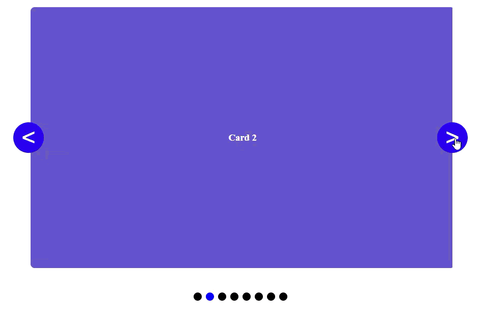

# A carousel made only with CSS and minimal html.

A `.carousel` class and a few `.card`s are all the markup thats needed. The rest, including scroll-buttons, scroll-markers and animations are pure CSS

